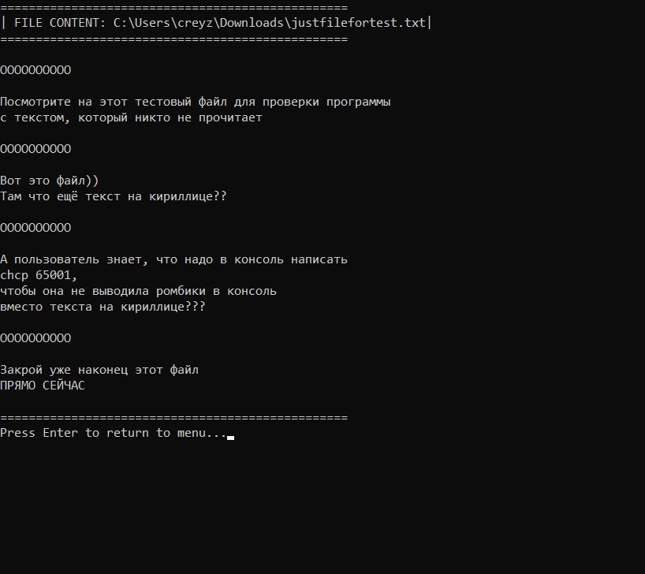
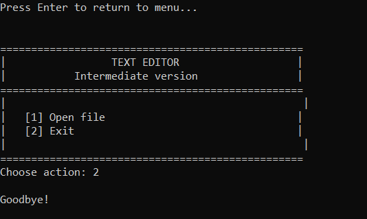

# TextEditor — текстовый редактор (промежуточная версия)

## О проекте

Консольный текстовый редактор с поддержкой открытия и просмотра файлов. Промежуточная версия проекта. Редактирование и подсветка синтаксиса будут добавлены в следующих версиях.

### Функциональность
- Открытие текстовых файлов по указанному пути
- Отображение содержимого файла в консоли
- Простое меню для навигации

### Технологии
- C++17
- CMake 3.10+
- Стандартная библиотека C++

## Используемые сторонние библиотеки

Сторонние библиотеки не используются. Все используемые заголовки — стандартная библиотека C++:

## Инструкция по сборке

### Требования
- CMake 3.10 или выше
- Компилятор C++17 (MinGW, Visual Studio, Clang)

### Шаги сборки (для Visual Studio 2022)

```bash
# Перейти в корневую директорию проекта

# 1. Сборка проекта
cmake -S . -B build -G "Visual Studio 17 2022"

# 2. Компиляция
cmake --build build --config Release

```

### Пересборка

```bash
# 1.
rmdir /s /q build

# 2. 
cmake -S . -B build -G "Visual Studio 17 2022"

# 3. 
cmake --build build --config Release
```

## Пример запуска

```bash
# Перейти в директорию исполняемого файла
cd build\Release

# Запустить
TextEditor.exe
```

---

## Демонстрация работы

---
### Главное меню


---

### Открытие файла


---

### Содержимое файла


---

### Завершение работы


---